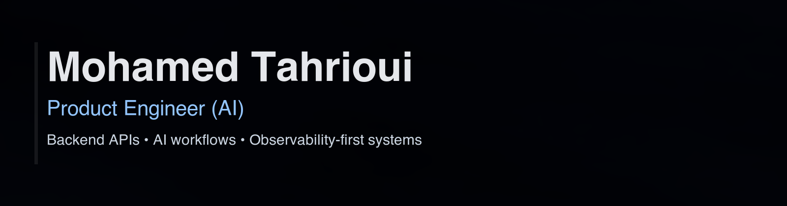

    <a href="https://4thel00z.dev/">Personal Blog</a> &mdash;
    <a href="https://ransomware.host">Personal Domain</a> &mdash;
    <a href="https://twitter.com/_ransomware">Twitter</a>

 
 

 
 

I [hägg](https://www.urbandictionary.com/define.php?term=Hagg#15390684) stuff for a living.
Currently my favourite language is [go](https://golang.org/), I'm pretty decent in [Python](https://www.python.org/) and other languages as well.

I treat linux as a first level citizen. I do not *intentially* produce code targetting the Windows platform (as a compilation target lol) unless stated otherwise in the project description. So don't bother me with Windows related questions thx.

If you want to reach me to work with me, send me an email [here](mailto:4thel00z@gmail.com?subject=[GitHub]).
Here is my [public gpg key](http://keys.gnupg.net/pks/lookup?op=get&search=0xD0E70B7A61EDA0BA).

<h3 align="center">Languages and Tools</h3>

                   

<h3 align="center">My stats</h3>

<h1 align="center">The End.</h1>

