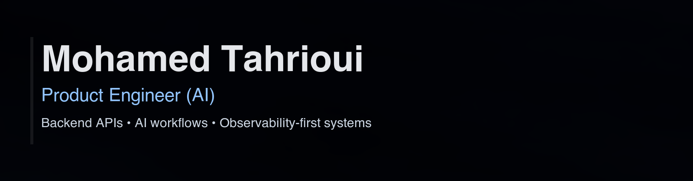

  
  
   
   

  <!-- Contact & Links Badges -->
  
  
  
   
   

## Product Engineer (AI)

I build and ship product features end-to-end: from idea → architecture → implementation → shipping → iterating with real-world customer feedback.

### What I build

- AI-assisted product features (agents, retrieval, evaluation workflows)
- Backend APIs and services (clean contracts, pragmatic architecture)
- Event-driven systems and integrations
- Observability-first systems (metrics, logs, traces; debuggable by default)
- Developer experience (SDKs, tooling, paved roads)

### How I work

- Strong ownership, fast iteration, and clear communication
- prefer boring, reliable solutions (and I know when not to)
- care about maintainability: tests where they matter, docs where they help
- like tight feedback loops: instrument, ship, observe, improve

### Current interests

- Product engineering in the AI space (agents, retrieval, evals, guardrails)
- Building systems that are simple to operate and hard to break

### Toolbox

- **Core**: Python, Go, Rust, TypeScript
- **Data**: Postgres, MySQL, SQLite, Redis, Qdrant
- **Infra**: Linux, Docker, Kubernetes, Terraform, Helm
- **Messaging & async**: Kafka, RabbitMQ, SQS/SNS, Temporal, DBOS
- **Cloud**: AWS (primary), plus Azure/GCP when needed
- **Observability**: OpenTelemetry, Prometheus, Grafana, tracing/telemetry-first debugging
- **AI systems**: RAG/search workflows, evaluation harnesses, retrieval quality loops, guardrails

### 📬 Contact

Open to product engineering roles at early-stage startups (especially in the AI space).

- **Website/Blog**: `https://tahrioui.de/`
- **Email**: [mohamedmustaphatahrioui@gmail.com](mailto:mohamedmustaphatahrioui@gmail.com)

### Recent projects

<!--RECENT_PROJECTS:start-->

- **[code-walkthrough](https://github.com/4thel00z/code-walkthrough)** • Go
- **[memories](https://github.com/4thel00z/memories)** • Go
- **[4thel00z](https://github.com/4thel00z/4thel00z)** — My github frontpage.
- **[competitor-analysis](https://github.com/4thel00z/competitor-analysis)** — Scrape competitor websites, extract features, estimate implementation costs. Interactive Gumroad-styled dashboard. • HTML
- **[qdrant-operator](https://github.com/4thel00z/qdrant-operator)** • Python
- **[mitmproxy-tools](https://github.com/4thel00z/mitmproxy-tools)**
- **[webhookd](https://github.com/4thel00z/webhookd)** — Why trust online webhook services with your data when you can run your own webhooks? 🎣 • Go — latest release: [v1.1.0](https://github.com/4thel00z/webhookd/releases/tag/v1.1.0) (2025-12-25)
- **[percently](https://github.com/4thel00z/percently)** — ⚡️ Blazing-fast percentile calculator (p50/p95/p99) in Rust — with Python bindings • Rust
<!--RECENT_PROJECTS:end-->

